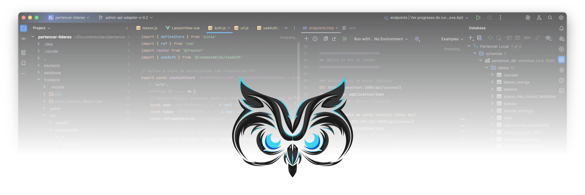
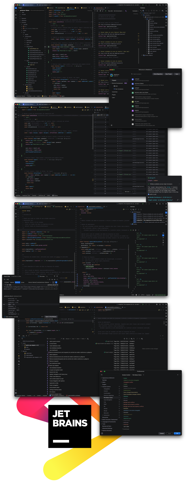

# Dark Cool Theme



>  <br>
> **This theme passed all official JetBrains compatibility tests!**

<!-- Plugin description -->

The Dark Cool Theme builds upon the outstanding design work of the JetBrains team in their default themes, taking it a step further by exploring even darker backgrounds to provide greater visual comfort during long coding sessions.
After UI adjustments, we carefully rebalanced the color schemes—minimizing excessive contrasts while still ensuring excellent readability. The result is a theme that follows the best interface design practices and undergoes rigorous contrast and legibility testing.

If you love JetBrains' original themes but are looking for an even darker, more comfortable interface for extended reading and coding, Dark Cool Theme is the perfect choice for you.

* Carefully refined color scheme, based on JetBrains’ default themes but with deeper dark backgrounds for extra comfort
* Thoughtful contrast balancing for reduced eye strain and maximum readability

* Modern, minimal interface that’s both stylish and distraction-free — perfect for long coding sessions

<br>

*Project repository:*

[](https://github.com/Peixekru/jetbrains-dark-cool-theme)

---

<!-- Plugin description end -->

## Table of Contents

* [Installation](#installation)
* [Features](#features)
* [Screenshots](#screenshots)
* [How to contribute](#how-to-contribute)
* [Build & Development](#build--development)
* [Changelog](#changelog)
* [License](#license)
* [Useful Links](#useful-links)

---

## Installation

You can install **Dark Cool Theme** in three ways:

### 1. JetBrains Marketplace (recommended)

[](https://plugins.jetbrains.com/plugin/27905-dark-cool-theme)

> Search for **Dark Cool Theme** in your JetBrains IDE’s plugins panel, click install, and you’re ready!

<br>

### 2. Manual installation via .zip

* Download the `.zip` from the [release page](https://github.com/Peixekru/jetbrains-dark-cool-theme/releases)
* In your IDE:
  `Settings` → `Plugins` → `⚙️` → `Install Plugin from Disk…`
* Select the downloaded file.

### 3. Clone and build locally (dev)

```sh
git clone https://github.com/Peixekru/jetbrains-dark-cool-theme.git
cd jetbrains-dark-cool-theme
./gradlew buildPlugin
```

Then, install the `.zip` file generated in `/build/distributions/` in your IDE.

---

## Features

* Modern & Minimalist: A clean, distraction-free dark theme for all JetBrains IDEs
* Balanced Contrast: Carefully optimized color scheme for reduced eye strain, even in long coding sessions
* Refined Palette: Unique blend of cyberpunk, minimalism, and elegant dark tones — never harsh, always readable
* Polished Integration: Custom icons and interface tweaks that seamlessly extend the JetBrains design language
* Wide Compatibility: Works perfectly with IntelliJ, WebStorm, PyCharm, Rider, and all major JetBrains IDEs

---

## Screenshots



---

## How to contribute

Your contributions are highly appreciated!
If you have ideas to improve the theme, spot any bugs, or want to help with development, here’s how to get started:

* Open an issue – Describe your suggestion or problem clearly so others can discuss and help.
* Fork this repository – Make your changes in a new, descriptive branch.
* Create a pull request – Explain what you’ve changed and why.

Whether it’s a new color suggestion, a UI tweak, or just reporting a typo, every contribution helps make Dark Cool Theme even better!

[](https://github.com/Peixekru/jetbrains-dark-cool-theme/issues)
[](https://github.com/Peixekru/jetbrains-dark-cool-theme/fork)
[](https://github.com/Peixekru/jetbrains-dark-cool-theme/pulls)


---

## Build & Development

This project uses the JetBrains plugin standard with Gradle Kotlin DSL.

**Build locally:**

```sh
./gradlew buildPlugin
```

**Run in IDE for testing:**

```sh
./gradlew runIde
```

**Main configuration file:**
`src/main/resources/META-INF/plugin.xml`

**Theme file:**
`src/main/resources/CoolDark.theme.json`

---

## Changelog

See recent changes in [CHANGELOG.md](./CHANGELOG.md).

---

## License

Distributed under the [MIT License](./LICENSE).

---

## Useful Links

* [JetBrains Plugin SDK (Docs)](https://plugins.jetbrains.com/docs/intellij/)
* [Theme Creation Guide](https://plugins.jetbrains.com/docs/intellij/themes-intro.html)
* [Platform Plugin Template (GitHub)](https://github.com/JetBrains/intellij-platform-plugin-template)
* [Marketplace Page](https://plugins.jetbrains.com/plugin/27905-dark-cool-theme)

---
